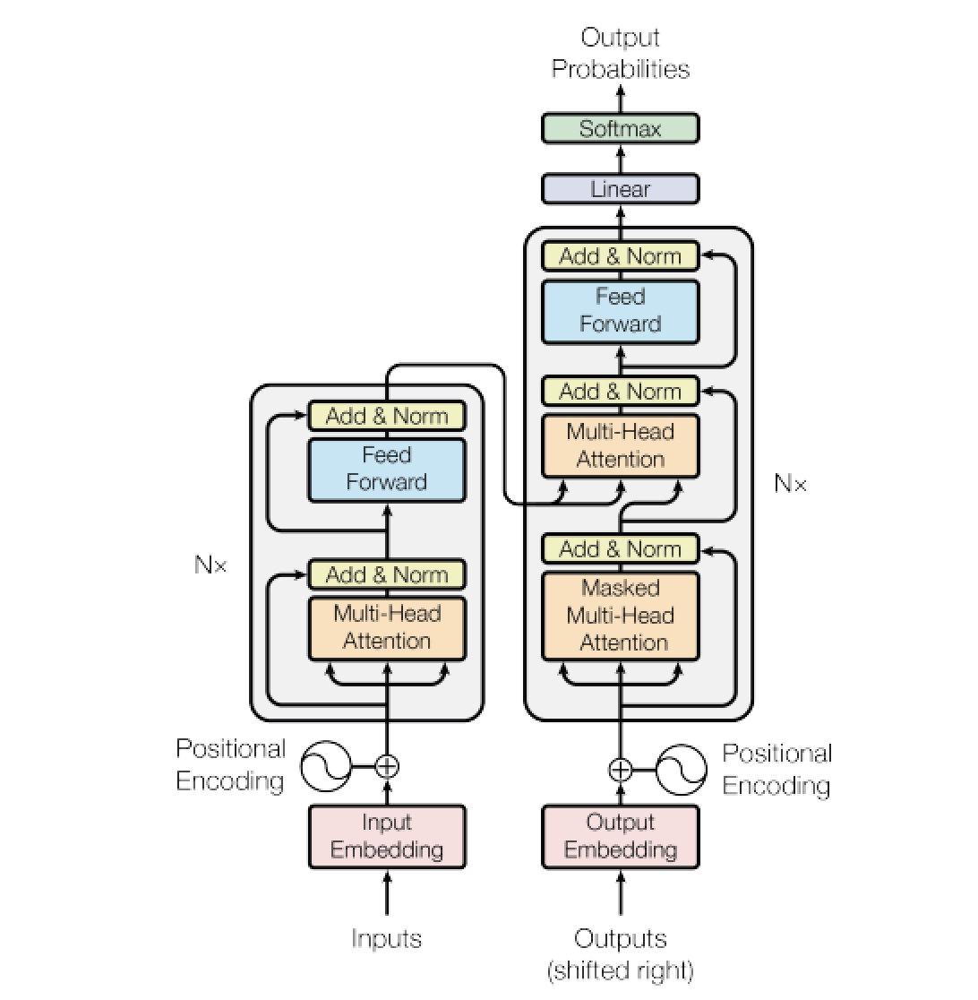
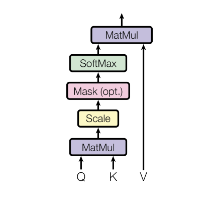

# GraphTransformers
Inspirations, approaches, datasets and state-of-art about Transformers and its variations.

## Table of Contents
1. [Transformers Overview](#transformers-overview)
2. [Transformers Components](#transformers-components)  
    2.1 [Attention Mechanism](#attention-mechanism)  
    2.2 [Scaled Dot Product Attention](#scaled-dot-product-mechanism)  
    2.3 [Multi-Head Attention](#multi-head-attention)  
    2.4 [Transformer Encoder](#transformer-encoder)  
    2.5 [Positional encoding](#positional-encoding)  
4. [Graph Transformers Neural Network (GTNN)](#graph-transformers-neural-network)  
5. [Graph Transformers Neural Network Components](#graph-transformers-neural-network-components)  
    5.1 [GNNs as Auxiliary Modules in Transformer](#gnn-as-auxiliary-modules-in-transformer)  
    5.2 [Improved Positional Embeddings from Graphs](#improved-positional-embeddings-from-graphs)  
    5.3 [Improved Attention Matrices from Graphs](#improved-attention-matrices-from-graphs)  
    5.4 [Graph Attention Network (GAT)](#graph-attention-network)  
    5.5 [Feed-Forward MLP](#feed-forward-mlp)  
7. [Transformers Neural Network References](#transformers-neural-network-refs)
8. [Graph Transformers Neural Network References](#graph-transformers-neural-network-refs)
9. [Codes](#codes)

### 

### Transformers Overview 

|:--:| 
| *Source: [Attention Is All You Need](https://proceedings.neurips.cc/paper/2017/file/3f5ee243547dee91fbd053c1c4a845aa-Paper.pdf)* |

Transformer neural nets are a recent class of neural networks for sequences, based on self-attention, that have been shown to be well adapted to text and are currently driving important progress in natural language processing.

### Transformers Components 

#### Attention Mechanism 

The attention mechanism describes a recent new group of layers in neural networks that has attracted a lot of interest in the past few years, especially in sequence tasks. There are a lot of different possible definitions of "attention" in the literature, but the one we will use here is the following: the attention mechanism describes a weighted average of (sequence) elements with the weights dynamically computed based on an input query and elements' keys. So what does this exactly mean? The goal is to take an average over the features of multiple elements. However, instead of weighting each element equally, we want to weight them depending on their actual values. In other words, we want to dynamically decide on which inputs we want to "attend" more than others. 

#### Scaled Dot Product Attention 

|:--:| 
| *Source: [Attention Is All You Need](https://proceedings.neurips.cc/paper/2017/file/3f5ee243547dee91fbd053c1c4a845aa-Paper.pdf)* |

The core concept behind self-attention is the scaled dot product attention. Our goal is to have an attention mechanism with which any element in a sequence can attend to any other while still being efficient to compute. 

#### Multi-Head Attention 

|:--:| 
| *Source: [Attention Is All You Need](https://proceedings.neurips.cc/paper/2017/file/3f5ee243547dee91fbd053c1c4a845aa-Paper.pdf)* |

The scaled dot product attention allows a network to attend over a sequence. However, often there are multiple different aspects a sequence element wants to attend to, and a single weighted average is not a good option for it. This is why we extend the attention mechanisms to multiple heads, i.e. multiple different query-key-value triplets on the same features. Specifically, given a query, key, and value matrix, we transform those into  ℎ  sub-queries, sub-keys, and sub-values, which we pass through the scaled dot product attention independently.

#### Transformer Encoder 

Originally, the Transformer model was designed for machine translation. Hence, it got an encoder-decoder structure where the encoder takes as input the sentence in the original language and generates an attention-based representation. On the other hand, the decoder attends over the encoded information and generates the translated sentence in an autoregressive manner, as in a standard RNN. While this structure is extremely useful for Sequence-to-Sequence tasks with the necessity of autoregressive decoding, we will focus here on the encoder part. 

#### Positional encoding 

We have discussed before that the Multi-Head Attention block is permutation-equivariant, and cannot distinguish whether an input comes before another one in the sequence or not. In tasks like language understanding, however, the position is important for interpreting the input words. The position information can therefore be added via the input features. We could learn a embedding for every possible position, but this would not generalize to a dynamical input sequence length. Hence, the better option is to use feature patterns that the network can identify from the features and potentially generalize to larger sequences. 

### Graph Transformers Neural Network 

If we were to do multiple parallel heads of neighbourhood aggregation and replace summation over the neighbours  with the attention mechanism, i.e., a weighted sum, we'd get the Graph Attention Network (GAT). Add normalization and the feed-forward MLP, and voila, we have a Graph Transformer!

### Graph Transformers Neural Network Components 

#### GNNs as Auxiliary Modules in Transformer 

#### Improved Positional Embeddings from Graphs 

#### Improved Attention Matrices from Graphs 

#### Graph Attention Network (GAT) 

|:--:| 
| *Source: [Graph Attention Networks](https://petar-v.com/GAT/)* |

Graph attention networks (GATs), novel neural network architectures that operate on graph-structured data, leveraging masked self-attentional layers to address the shortcomings of prior methods based on graph convolutions or their approximations. By stacking layers in which nodes are able to attend over their neighborhoods' features, we enable (implicitly) specifying different weights to different nodes in a neighborhood, without requiring any kind of costly matrix operation (such as inversion) or depending on knowing the graph structure upfront. In this way, we address several key challenges of spectral-based graph neural networks simultaneously, and make our model readily applicable to inductive as well as transductive problems.

### Feed-Forward MLP 

#### Transformers Neural Network References 

#### Graph Transformers Neural Network References 

* [A Generalization of Transformer Networks to Graphs](https://www.semanticscholar.org/paper/A-Generalization-of-Transformer-Networks-to-[Graphs-Dwivedi-Bresson/849b88ddc8f8cabc6d4246479b275a1ee65d0647)  
* [LET: Linguistic Knowledge Enhanced Graph Transformer for Chinese Short Text Matching](https://www.semanticscholar.org/paper/LET%3A-Linguistic-Knowledge-Enhanced-Graph-for-Short-Lyu-Chen/d8e8e35bf4cf8821ade2d58b34d9ae23a9b08ab2)  
* [Knowledge-Enhanced Hierarchical Graph Transformer Network for Multi-Behavior Recommendation](https://www.semanticscholar.org/paper/[Knowledge-Enhanced-Hierarchical-Graph-Transformer-Xia-Huang/90b1ffb667528ca1aa62bb2f843f95290ab04f35)  
* [Geometric Transformers for Protein Interface Contact Prediction](https://www.semanticscholar.org/paper/Geometric-Transformers-for-Protein-Interface-Morehead-Chen/0ab0e3b97c2f24565af38bbfba0ba60b5a11d8b3)  
* [Retrieving Complex Tables with Multi-Granular Graph Representation Learning](https://www.semanticscholar.org/paper/Retrieving-Complex-[Tables-with-Multi-Granular-Graph-Wang-Sun/221ce6b97e4128ea3af592c885239367e48df095)  
* [HetEmotionNet: Two-Stream Heterogeneous Graph Recurrent Neural Network for Multi-modal Emotion Recognition](https://www.semanticscholar.org/paper/HetEmotionNet%3A-Two-Stream-Heterogeneous-Graph-for-Jia-Lin/ff6fa19cfe09995161a47a0cb9af3d433bf1f0dd)  
* [A community-powered search of machine learning strategy space to find NMR property prediction models](https://www.semanticscholar.org/paper/A-community-powered-search-of-machine-learning-to-Bratholm-Gerrard/99b5a3b891fcf8ce2a1069ff6cf0c13cac140683)  
* [Edge-augmented Graph Transformers: Global Self-attention is Enough for Graphs](https://www.semanticscholar.org/paper/Edge-augmented-[Graph-Transformers%3A-Global-is-Enough-Hussain-Zaki/6a4332d5759f4f7c427fbcd2fecddae585848a67)  
* [Transformer for Graphs: An Overview from Architecture Perspective](https://www.semanticscholar.org/paper/Transformer-for-Graphs%3A-An-Overview-from-Min-Chen/e58dde4b23f251314e900f56e765b4aad27bc15f)  
* [Power Law Graph Transformer for Machine Translation and Representation Learning](https://www.semanticscholar.org/paper/Power-Law-Graph-Transformer-for-Machine-Translation-Gokden/06ecf5fc22a4271bdb89719922cd39b6643507af)  
* [HeteroQA: Learning towards Question-and-Answering through Multiple Information Sources via Heterogeneous Graph Modeling](https://www.semanticscholar.org/paper/HeteroQA%3A-Learning-towards-Question-and-Answering-Gao-Zhang/e04149504ae7c95e474750aaca9a96fc4611ca83)  
* [Unsupervised Pre-Training on Patient Population Graphs for Patient-Level Predictions](https://www.semanticscholar.org/paper/Unsupervised-Pre-Training-on-Patient-Population-for-Pellegrini-Kazi/4cc10ca3f7837aa0269610b419b9f270dbffa830)  
* [Anomaly Detection in Dynamic Graphs via Transformer](https://www.semanticscholar.org/paper/Anomaly-Detection-in-Dynamic-Graphs-via-Transformer-Liu-Pan/ddb842d2d609ddd535c4d15637e4bcd2c6d834b2)  
* [Activity Graph Transformer for Temporal Action Localization](https://www.semanticscholar.org/paper/Activity-Graph-Transformer-for-Temporal-Action-Nawhal-Mori/a4e45054b6680d8f8584e389180e0c402a679843)  
* [Gophormer: Ego-Graph Transformer for Node Classification](https://www.semanticscholar.org/paper/Gophormer%3A-Ego-Graph-Transformer-for-Node-Zhao-Li/07df27f2c7ecacca99a581efbf4be7a0b3b3ba8b)  
* [BERT-GT: Cross-sentence n-ary relation extraction with BERT and Graph Transformer](https://www.semanticscholar.org/paper/BERT-GT%3A-Cross-sentence-n-ary-relation-extraction-Lai-Lu/0bb30ed3340d2c34fe9f37c5002929bc5f458c23)  
* [TransMOT: Spatial-Temporal Graph Transformer for Multiple Object Tracking](https://www.semanticscholar.org/paper/TransMOT%3A-Spatial-Temporal-Graph-Transformer-for-Chu-Wang/75a98b6ce3279848c806fc1ad18100bf666b4933)  
* [Improved Drug-target Interaction Prediction with Intermolecular Graph Transformer](https://www.semanticscholar.org/paper/Improved-Drug-target-Interaction-Prediction-with-Liu-Wang/1ce5f097564e85813b9c9cfc7273eb090dfede24)  
* [SEA: Graph Shell Attention in Graph Neural Networks](https://www.semanticscholar.org/paper/SEA%3A-Graph-Shell-Attention-in-Graph-Neural-Networks-Frey-Ma/d7b87888f4a295fca17c1211e7d8bde3f2200b2c)  
* [Dynamic Graph Representation Learning via Graph Transformer Networks](https://www.semanticscholar.org/paper/Dynamic-Graph-Representation-Learning-via-Graph-Cong-Wu/85994a0e35cb194f333270dc26e2cf76a51226f1)  
* [Multivariate Realized Volatility Forecasting with Graph Neural Network](https://www.semanticscholar.org/paper/Multivariate-Realized-Volatility-Forecasting-with-Chen-Robert/d0cf8248cccd26626c46a07b88e270cbd3ae5a67)  
* [SGEITL: Scene Graph Enhanced Image-Text Learning for Visual Commonsense Reasoning](https://www.semanticscholar.org/paper/SGEITL%3A-Scene-Graph-Enhanced-Image-Text-Learning-Wang-You/c11ee33dea3f83cd77dcbc14684ee305b7a7e184)  
* [Zero-Shot Sketch Based Image Retrieval using Graph Transformer](https://www.semanticscholar.org/paper/Zero-Shot-Sketch-Based-Image-Retrieval-using-Graph-Gupta-Chaudhuri/c8d2d775b1b92ffb38cf2d9579c979d200cac66d)  
* [AlphaDesign: A graph protein design method and benchmark on AlphaFoldDB](https://www.semanticscholar.org/paper/AlphaDesign%3A-A-graph-protein-design-method-and-on-Gao-Tan/eb3ecc13263ec728ec7bdfbc755714997c52ebde)  
* [Graph Masked Autoencoder](https://www.semanticscholar.org/paper/Graph-Masked-Autoencoder-Chen-Zhang/850e7a5d017c65e3caa3798f3c16583369ea8798)
* [Think Global, Act Local: Dual-scale Graph Transformer for Vision-and-Language Navigation](https://www.semanticscholar.org/paper/Think-Global%2C-Act-Local%3A-Dual-scale-Graph-for-Chen-Guhur/0f01088765729402e903ec560f3246f884d324f8)  
* [TransCamP: Graph Transformer for 6-DoF Camera Pose Estimation](https://www.semanticscholar.org/paper/TransCamP%3A-Graph-Transformer-for-6-DoF-Camera-Pose-Li-Ling/3f56259e58049b8291865c422ff75b8ef99476eb)  
* [On Representation Learning for Scientific News Articles Using Heterogeneous Knowledge Graphs](https://www.semanticscholar.org/paper/On-Representation-Learning-for-Scientific-News-Romanou-Smeros/89ea9ca4ae0b8e9b80911018d306184e0a521485)  
* [Extracting Temporal Event Relation with Syntactic-Guided Temporal Graph Transformer](https://www.semanticscholar.org/paper/Extracting-Temporal-Event-Relation-with-Temporal-Zhang-Huang/965840bb0a8803b78c169f4b387e9e14cc80fffc)  
* [GTN-ED: Event Detection Using Graph Transformer Networks](https://www.semanticscholar.org/paper/GTN-ED%3A-Event-Detection-Using-Graph-Transformer-Dutta-Ma/dd21645a340c1af98c3b64ae76da15b2cac51569)  
* [GTAE: Graph-Transformer based Auto-Encoders for Linguistic-Constrained Text Style Transfer](https://www.semanticscholar.org/paper/GTAE%3A-Graph-Transformer-based-Auto-Encoders-for-Shi-Zhang/ebb1e3e36e7fad1d2a4651f57ac503339a017085)  
* [Dynamic Graph Transformer for Implicit Tag Recognition](https://www.semanticscholar.org/paper/Dynamic-Graph-Transformer-for-Implicit-Tag-Liou-Chen/57cc9670e51ed0c0f9a8a4496fd44a18d5e779d3)  
* [Graph transformer network with temporal kernel attention for skeleton-based action recognition](https://www.scopus.com/inward/record.uri?eid=2-s2.0-85123686596&doi=10.1016%2fj.knosys.2022.108146&partnerID=40&md5=7ba3b78bc71f9b01bb1c587764f78de7)  
* [Relation-aware Heterogeneous Graph Transformer based drug repurposing[Formula presented]](https://www.scopus.com/inward/record.uri?eid=2-s2.0-85119361240&doi=10.1016%2fj.eswa.2021.116165&partnerID=40&md5=c144344c87aac931041e16f8cfee6da2)  
* [Blockchain-enabled fraud discovery through abnormal smart contract detection on Ethereum](https://www.scopus.com/inward/record.uri?eid=2-s2.0-85117817744&doi=10.1016%2fj.future.2021.08.023&partnerID=40&md5=4c2e7632f63f1c8576e4333fc8d0f185)  
* [Transformer-Based Graph Convolutional Network for Sentiment Analysis](https://www.scopus.com/inward/record.uri?eid=2-s2.0-85123435934&doi=10.3390%2fapp12031316&partnerID=40&md5=244de6d6498424828a1cc21d0daf3a69)  
* [RGTransformer: Region-Graph Transformer for Image Representation and Few-shot Classification](https://www.scopus.com/inward/record.uri?eid=2-s2.0-85125723742&doi=10.1109%2fLSP.2022.3155991&partnerID=40&md5=361de252dfc2642f74ac50de32c37cd6)  
* [Multi-Omic Graph Transformers for Cancer Classification and Interpretation](https://www.scopus.com/inward/record.uri?eid=2-s2.0-85122500037&partnerID=40&md5=da56e8d25a9ddf1e18398a1d32f78b85)  
* [Relation-Aware Graph Transformer for SQL-to-Text Generation](https://www.scopus.com/inward/record.uri?eid=2-s2.0-85122062993&doi=10.3390%2fapp12010369&partnerID=40&md5=a900647815abc4c2e2bfaff3a23d736f)  
* [Assembled graph neural network using graph transformer with edges for protein model quality assessment](https://www.scopus.com/inward/record.uri?eid=2-s2.0-85118878925&doi=10.1016%2fj.jmgm.2021.108053&partnerID=40&md5=5f6d692870f42f5f604497f978584f16)  
* [Graph transformer for communities detection in social networks](https://www.scopus.com/inward/record.uri?eid=2-s2.0-85116987352&doi=10.32604%2fcmc.2022.021186&partnerID=40&md5=1c44be3b74f24c64827c3b272bac7a9d)  
* [Contrastive learning of graph encoder for accelerating pedestrian trajectory prediction training](https://www.scopus.com/inward/record.uri?eid=2-s2.0-85103981123&doi=10.1049%2fipr2.12185&partnerID=40&md5=eca1d789214dd7f8cb1a8f7ebf332d56)  
* [Graph transformer networks based text representation](https://www.scopus.com/inward/record.uri?eid=2-s2.0-85113286501&doi=10.1016%2fj.neucom.2021.08.032&partnerID=40&md5=92341667290ff5cf75d392f3603dfada)  
* [Latent Memory-augmented Graph Transformer for Visual Storytelling](https://www.scopus.com/inward/record.uri?eid=2-s2.0-85119333125&doi=10.1145%2f3474085.3475236&partnerID=40&md5=e0fc2183943575ac1feb3dd285397659)  
* [Pre-training Graph Transformer with Multimodal Side Information for Recommendation](https://www.scopus.com/inward/record.uri?eid=2-s2.0-85118999559&doi=10.1145%2f3474085.3475709&partnerID=40&md5=9c322ff0b53a875a96ac7715402b7424)  
* [Element graph-augmented abstractive summarization for legal public opinion news with graph transformer](https://www.scopus.com/inward/record.uri?eid=2-s2.0-85111272886&doi=10.1016%2fj.neucom.2021.07.013&partnerID=40&md5=e8b1f50aa0ee95b26a18f012e7acb363)  
* [The framework design of question generation based on knowledge graph](https://www.scopus.com/inward/record.uri?eid=2-s2.0-85125852157&doi=10.1145%2f3488838.3488851&partnerID=40&md5=7b314efe1db43a77223cdca1edc09e84)  
* [Document-level relation extraction via graph transformer networks and temporal convolutional networks](https://www.scopus.com/inward/record.uri?eid=2-s2.0-85109706939&doi=10.1016%2fj.patrec.2021.06.012&partnerID=40&md5=b93befd46416e35d16082b761f25a3a3)  
* [Representation Learning on Knowledge Graphs for Node Importance Estimation](https://www.scopus.com/inward/record.uri?eid=2-s2.0-85114952522&doi=10.1145%2f3447548.3467342&partnerID=40&md5=799c5ceba9c0201e51088f4d4926ebcc)  
* [Heterogeneous Temporal Graph Transformer: An Intelligent System for Evolving Android Malware Detection](https://www.scopus.com/inward/record.uri?eid=2-s2.0-85114916272&doi=10.1145%2f3447548.3467168&partnerID=40&md5=6de5b0da9f1d498b76120b92758bd338)  
* [FACE-KEG: Fact Checking Explained using KnowledgE Graphs](https://www.scopus.com/inward/record.uri?eid=2-s2.0-85103047796&doi=10.1145%2f3437963.3441828&partnerID=40&md5=32da0488e9d7f7b7f049b47105fa3a34)  
* [STGT: Forecasting pedestrian motion using spatio-temporal graph transformer](https://www.scopus.com/inward/record.uri?eid=2-s2.0-85118883864&doi=10.1109%2fIV48863.2021.9575498&partnerID=40&md5=518a28b5920994a4ca04bc62e9a40776)  
* [GTAE: Graph transformer based auto-encoders for linguistic-constrained text style transfer](https://www.scopus.com/inward/record.uri?eid=2-s2.0-85122617690&doi=10.1145%2f3448733&partnerID=40&md5=abbd029d8c10d954a5905a67f73fdd5c)  
* [Recursive non-autoregressive graph-to-graph transformer for dependency parsing with iterative refinement](https://www.scopus.com/inward/record.uri?eid=2-s2.0-85110472390&doi=10.1162%2ftacl_a_00358&partnerID=40&md5=74f28c64ca6cb9caf6599e48f8eae6ae)  
* [Directional Graph Transformer-Based Control Flow Embedding for Malware Classification](https://www.scopus.com/inward/record.uri?eid=2-s2.0-85126431246&doi=10.1007%2f978-3-030-91608-4_42&partnerID=40&md5=29f2d8e671093dd4199da4156ec9d1e1)  
* [Graph Transformer Attention Networks for Traffic Flow Prediction](https://www.scopus.com/inward/record.uri?eid=2-s2.0-85125364124&doi=10.1109%2fICCC54389.2021.9674238&partnerID=40&md5=75439ad2a782dc5f0ef342cdf189f7d8)  
* [Stacked Graph Transformer for HIV Molecular Prediction](https://www.scopus.com/inward/record.uri?eid=2-s2.0-85125046656&doi=10.1109%2fC2I454156.2021.9689399&partnerID=40&md5=70d7f6ae7ac63d08445c1ec70cab74e6)  
* [User Identification in Online Social Networks using Graph Transformer Networks](https://www.scopus.com/inward/record.uri?eid=2-s2.0-85124072388&doi=10.1109%2fPST52912.2021.9647749&partnerID=40&md5=8703aede52d59c5932a14f71462b4307)  
* [Research on Intelligent Diagnosis Model of Electronic Medical Record Based on Graph Transformer](https://www.scopus.com/inward/record.uri?eid=2-s2.0-85123953800&doi=10.1109%2fICCIA52886.2021.00022&partnerID=40&md5=73fd48e66ec9c2d952d9afb6cd73a5e8)  
* [Propagation-Based Fake News Detection Using Graph Neural Networks with Transformer](https://www.scopus.com/inward/record.uri?eid=2-s2.0-85123473564&doi=10.1109%2fGCCE53005.2021.9621803&partnerID=40&md5=90897679fc270b3ece189ba74e3b12b2)  
* [Graph transformer-convolution network for graph classification](https://www.scopus.com/inward/record.uri?eid=2-s2.0-85122871384&doi=10.1117%2f12.2624865&partnerID=40&md5=2eec012a30aedc841211c078af79a18f)  
* [CogTree: Cognition Tree Loss for Unbiased Scene Graph Generation](https://www.scopus.com/inward/record.uri?eid=2-s2.0-85122719781&partnerID=40&md5=cf32d0405c37841f3489b40307e9dc68)  
* [Meta Graph Transformer: A Novel Framework for Spatial–Temporal Traffic Prediction](https://www.scopus.com/inward/record.uri?eid=2-s2.0-85121918064&doi=10.1016%2fj.neucom.2021.12.033&partnerID=40&md5=1a4386efee5b25df351003de3e7008cc)  
* [Learning contextual representations of citations via graph transformer](https://www.scopus.com/inward/record.uri?eid=2-s2.0-85121226139&partnerID=40&md5=8bc59b090a031bbe6c1186b9a64dad08)  
* [Masked Label Prediction: Unified Message Passing Model for Semi-Supervised Classification](https://www.scopus.com/inward/record.uri?eid=2-s2.0-85119882316&partnerID=40&md5=d2a3945ee3a3d353838ca5b8cd77160c)  
* [Knowledge based natural answer generation via masked-graph transformer](https://www.scopus.com/inward/record.uri?eid=2-s2.0-85118099914&doi=10.1007%2fs11280-021-00932-0&partnerID=40&md5=84125be0df7f5fd09ab738c665647d6b)  
* [Graph Transformers for Characterization and Interpretation of Surgical Margins](https://www.scopus.com/inward/record.uri?eid=2-s2.0-85116428499&doi=10.1007%2f978-3-030-87234-2_9&partnerID=40&md5=ac21e6aaf92924c3856be3c0af2b1826)  
* [Structure-Function Mapping via Graph Neural Networks](https://www.scopus.com/inward/record.uri?eid=2-s2.0-85116342393&doi=10.1007%2f978-3-030-87586-2_14&partnerID=40&md5=94a2bfb5811f4781c8cff7d8131ae13b)  
* [Application of Multiattention Mechanism in Power System Branch Parameter Identification](https://www.scopus.com/inward/record.uri?eid=2-s2.0-85114988139&doi=10.1155%2f2021%2f1834428&partnerID=40&md5=43a68cc6500173b96f0cb231623a3c5a)  
* [Fraud Detection in Online Product Review Systems via Heterogeneous Graph Transformer](https://www.scopus.com/inward/record.uri?eid=2-s2.0-85107382979&doi=10.1109%2fACCESS.2021.3084924&partnerID=40&md5=6766efd12603b2b269f7ae3947d7d943)  
* [Graph Transformer: Learning Better Representations for Graph Neural Networks](https://www.scopus.com/inward/record.uri?eid=2-s2.0-85104785233&doi=10.1007%2f978-3-030-73973-7_14&partnerID=40&md5=e9712fbabcc6f284424df47356c80a65)  
* [Joint IAPR International Workshops on Structural, Syntactic and Statistical Techniques in Pattern Recognition, S+SSPR 2020](https://www.scopus.com/inward/record.uri?eid=2-s2.0-85104776333&partnerID=40&md5=7b34b471cf32ce7d27d430ab7c8c9459)  
* [Privacy-Preserving Visual Content Tagging using Graph Transformer Networks](https://www.scopus.com/inward/record.uri?eid=2-s2.0-85106902322&doi=10.1145%2f3394171.3414047&partnerID=40&md5=df15fb646e831ea8092386a27334a770)  
* [Forecaster: A graph transformer for forecasting spatial and time-dependent data](https://www.scopus.com/inward/record.uri?eid=2-s2.0-85091800365&doi=10.3233%2fFAIA200231&partnerID=40&md5=dcaced6b65a25eeb4aa9fa334a2519ba)  
* [Learning Bi-directional Social Influence in Information Cascades using Graph Sequence Attention Networks](https://www.scopus.com/inward/record.uri?eid=2-s2.0-85091708859&doi=10.1145%2f3366424.3382677&partnerID=40&md5=4f0e8f1c807e084f5873a15dc722053b)  
* [Heterogeneous Graph Transformer](https://www.scopus.com/inward/record.uri?eid=2-s2.0-85086600966&doi=10.1145%2f3366423.3380027&partnerID=40&md5=2200a7007db8b447e8f3a76954a3852e)  
* [Question Generation from Knowledge Base with Graph Transformer](https://www.scopus.com/inward/record.uri?eid=2-s2.0-85119945713&partnerID=40&md5=38f209b5ee081421cd9be677e96f3516)  
* [Graph transformer networks with syntactic and semantic structures for event argument extraction](https://www.scopus.com/inward/record.uri?eid=2-s2.0-85111168249&partnerID=40&md5=b822125970b31c74a2c2139ef0dd8502)  
* [Self-supervised graph transformer on large-scale molecular data](https://www.scopus.com/inward/record.uri?eid=2-s2.0-85108414830&partnerID=40&md5=0cbf85dd4005170b3d56318e64d91d75)  
* [Graph transformer for graph-to-sequence learning](https://www.scopus.com/inward/record.uri?eid=2-s2.0-85106571553&partnerID=40&md5=658c3b98fdc778a9ed6b6351a97c73ea)  
* [Graph-to-graph transformer for transition-based dependency parsing](https://www.scopus.com/inward/record.uri?eid=2-s2.0-85106411347&partnerID=40&md5=311d6e4eda8080a5274ac31af23ff8e9)  
* [Text graph transformer for document classification](https://www.scopus.com/inward/record.uri?eid=2-s2.0-85104006648&partnerID=40&md5=796ebed11d0f89609097f365d6669d5a)  
* [Online back-parsing for AMR-to-text generation](https://www.scopus.com/inward/record.uri?eid=2-s2.0-85101703648&partnerID=40&md5=ef199cff5be3b55b1f7f2b5997879f1b)  
* [Natural Answer Generation via Graph Transformer](https://www.scopus.com/inward/record.uri?eid=2-s2.0-85093956437&doi=10.1007%2f978-3-030-60259-8_23&partnerID=40&md5=198d0597fe630f02ad20762e0cd335aa)  
* [Spatio-Temporal Graph Transformer Networks for Pedestrian Trajectory Prediction](https://www.scopus.com/inward/record.uri?eid=2-s2.0-85093077751&doi=10.1007%2f978-3-030-58610-2_30&partnerID=40&md5=f1069b52e12ed61ec06d8accd35d103f)  
* [Amr-to-text generation with graph transformer](https://www.scopus.com/inward/record.uri?eid=2-s2.0-85091446032&doi=10.1162%2ftacl_a_00297&partnerID=40&md5=4a698f41d3a76f23780e0119d1b70f71)  
* [Hierarchical Graph Transformer-Based Deep Learning Model for Large-Scale Multi-Label Text Classification](https://www.scopus.com/inward/record.uri?eid=2-s2.0-85081058031&doi=10.1109%2fACCESS.2020.2972751&partnerID=40&md5=1376cf7721ed6ff3f046f7ca9e9b4415)  
* [Graph transformer networks](https://www.scopus.com/inward/record.uri?eid=2-s2.0-85086569906&partnerID=40&md5=60b25030af844b5f67e06fe0445c4572)
* [Text generation from knowledge graphs with graph transformers](https://www.scopus.com/inward/record.uri?eid=2-s2.0-85079655513&partnerID=40&md5=ca349cd558be9df6d472894bc5d0745f)  
* [Knowledge-driven encode, retrieve, paraphrase for medical image report generation](https://www.scopus.com/inward/record.uri?eid=2-s2.0-85079520690&partnerID=40&md5=6db4b8fd8ceb12ca11af1264322b2075)  
* [Learning graphical state transitions](https://www.scopus.com/inward/record.uri?eid=2-s2.0-85084086160&partnerID=40&md5=8ff2c805751e89a1c21698e3e2c5b5ab)  
* [Deep learning for efficient discriminative parsing](https://www.scopus.com/inward/record.uri?eid=2-s2.0-84862289802&partnerID=40&md5=097c77a69a90aa14f10a48cff1730ad1)  
* [Energy-based models in document recognition and computer vision](https://www.scopus.com/inward/record.uri?eid=2-s2.0-51249093914&doi=10.1109%2fICDAR.2007.4378728&partnerID=40&md5=038357004cc557e1e84128ad19cefc0a)  
* [Stochastic learning](https://www.scopus.com/inward/record.uri?eid=2-s2.0-33947180792&doi=10.1007%2f978-3-540-28650-9_7&partnerID=40&md5=7d4c7fb987c8fefed469d81f35ed91cf)  
* [Machine learning for sequential data: A review](https://www.scopus.com/inward/record.uri?eid=2-s2.0-84951778046&doi=10.1007%2f3-540-70659-3_2&partnerID=40&md5=e19e0e404d98d539432eb4257b64681b)  
* [Object recognition with gradient-based learning](https://www.scopus.com/inward/record.uri?eid=2-s2.0-84947927646&doi=10.1007%2f3-540-46805-6_19&partnerID=40&md5=282291b836456fd50cbfd91f6789d009)  
* [Gradient-based learning applied to document recognition](https://www.scopus.com/inward/record.uri?eid=2-s2.0-0032203257&doi=10.1109%2f5.726791&partnerID=40&md5=bcd0f8af84203ead7e96411039389e6b)  
* [Δ-languages for sets and LOGSPACE computable graph transformers](https://www.scopus.com/inward/record.uri?eid=2-s2.0-0031094818&doi=10.1016%2fS0304-3975%2896%2900174-0&partnerID=40&md5=9c2407c979700c22515d03b005909160)   
* [Reading checks with multilayer graph transformer networks](https://www.scopus.com/inward/record.uri?eid=2-s2.0-0030677452&partnerID=40&md5=1f5fcd43bfd8c940f85e37b14e232b4f)  
* [Global training of document processing systems using graph transformer networks](https://www.scopus.com/inward/record.uri?eid=2-s2.0-0030648914&partnerID=40&md5=a81bd5847e8892658b8ebc496ead0e6b)  
* [Δ-Languages for sets and sub-PTIME graph transformers](https://www.scopus.com/inward/record.uri?eid=2-s2.0-21844520085&doi=10.1007%2f3-540-58907-4_11&partnerID=40&md5=1f63a078e1515950a445f38930bac711)  

#### Codes 
